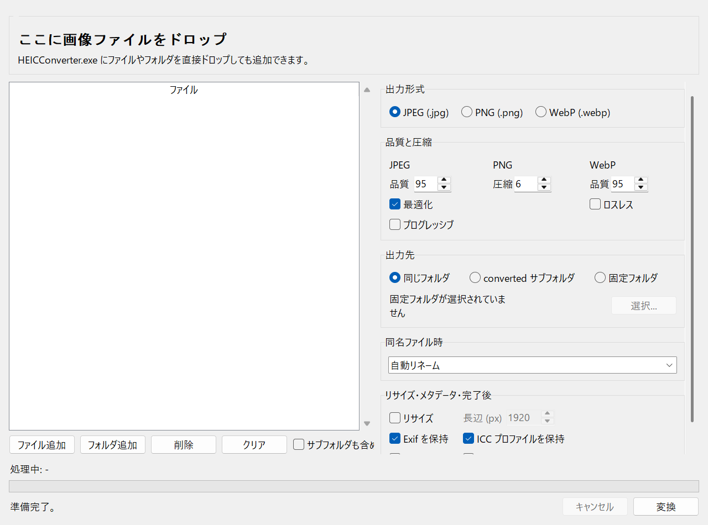
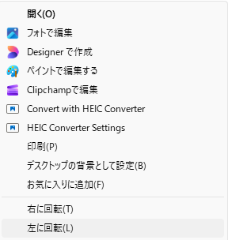
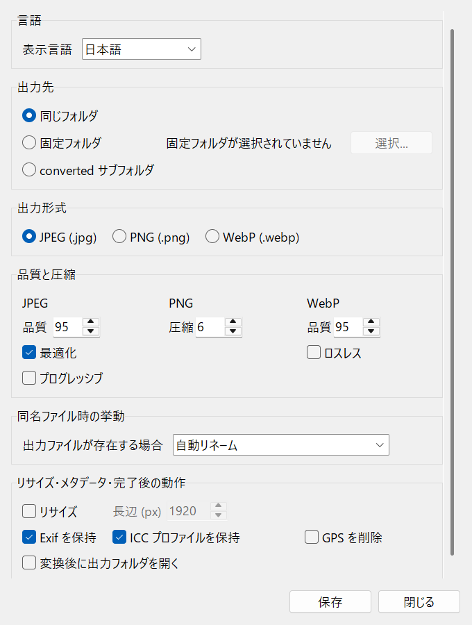
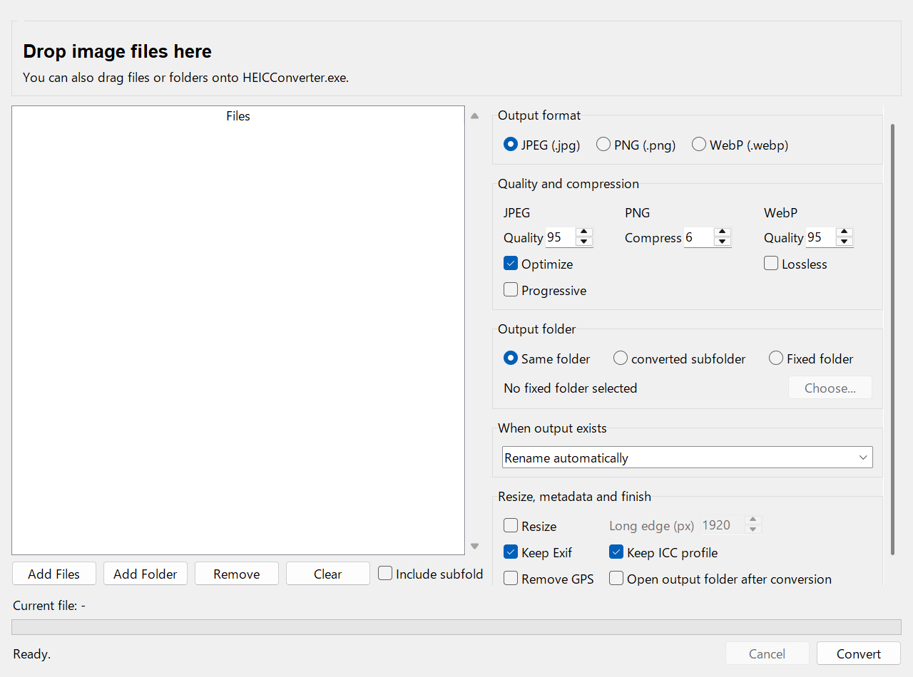
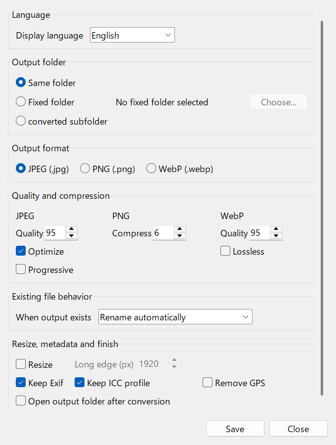

# HEIC Converter

Lightweight Windows converter for HEIC/HEIF and common image files.

## 日本語

### 機能

- File Explorer の右クリックから HEIC/HEIF や一般的な画像ファイルを変換できます。
- 変換元は `.heic` / `.heif` / `.jpg` / `.jpeg` / `.png` / `.webp` / `.bmp` / `.gif` / `.tif` / `.tiff` / `.avif` などに対応しています。
- 出力形式は JPEG (`.jpg`) / PNG (`.png`) / WebP (`.webp`) から選べます。
- 出力先は「同じフォルダ」「固定フォルダ」「`converted` サブフォルダ」から選べます。
- 同名ファイルがある場合の挙動は `rename` / `skip` / `overwrite` / `error` から選べます。デフォルトは `rename` です。
- JPEG quality / optimize / progressive、PNG compress level、WebP quality / lossless を設定できます。
- 最大長辺をピクセル数で指定し、縦横比を維持したまま画像を縮小できます。指定値より小さい画像は拡大しません。
- Exif 保持、ICC プロファイル保持、GPS 削除、変換後に出力フォルダを開く設定に対応しています。
- 複数ファイル変換では、1ファイルが失敗しても残りのファイルを続けて処理します。
- GUI は軽量な `tkinter` + `ttk` のみです。常駐監視や重い GUI フレームワークは使いません。

### まず使うなら配布ZIP

[HEICConverter.zip をダウンロード](https://github.com/AiWithYou/HEICtoJPG/releases/latest/download/HEICConverter.zip)して展開し、中の `HEICConverter.exe` をダブルクリックしてください。Python や PowerShell は不要です。

変換GUIが開いたら、画像ファイルやフォルダをドラッグ&ドロップして変換できます。画像ファイルやフォルダを `HEICConverter.exe` に直接ドロップして起動することもできます。zip にはライセンス文書も含まれます。右クリックメニューまでこの PC に入れたい場合は、下の「この PC へのインストール」を使います。

変換中は進捗バーと処理中ファイル名が表示され、キャンセルボタンで次のファイル開始前に停止できます。失敗したファイルがある場合は、変換完了後に一覧を表示します。



### この PC へのインストール

必要なもの:

- Windows 10 または 11
- `python` コマンドで実行できる Python 3.10 以上
- PowerShell

リポジトリのルートで実行します。

```powershell
.\scripts\setup_this_pc.ps1
```

PowerShell の実行ポリシーで止まる場合は、同じ場所で次を実行します。

```powershell
powershell -ExecutionPolicy Bypass -File .\scripts\setup_this_pc.ps1
```

セットアップは `%LOCALAPPDATA%\Programs\HEICtoJPG` に実行環境を作り、対応画像拡張子の右クリックメニューと Start Menu の `HEIC Converter Settings` ショートカットを登録します。管理者権限は不要です。

### 右クリック変換

File Explorer で対応画像ファイルを右クリックし、`Convert with HEIC Converter` を選びます。複数ファイル選択時にもメニューが表示されるように登録しています。大量変換では CLI の `convert-folder` を使う方が安定します。



右クリック変換は保存済み設定を使い、バックグラウンドで開始して File Explorer からすぐに切り離します。右クリック変換では、設定に関係なく出力フォルダを自動で開きません。初期状態では JPEG で、元ファイルと同じフォルダに保存します。同じフォルダへ出力すると Windows が一覧を更新することがあります。スクロール位置を保ちたい場合は、現在開いていない固定フォルダを出力先に設定してください。WebP 保存に対応していない Pillow 環境では、設定UIで WebP が無効表示され、CLI では分かりやすいエラーになります。アニメーション画像や複数ページ画像は、Pillow が読み込む最初のフレームを変換します。

### 配布ZIPとライセンス

配布先には GitHub Releases の `HEICConverter.zip` を案内してください。

配布時のライセンス方針:

- `HEICConverter.exe` だけを単体で配布しないでください。
- [HEICConverter.zip](https://github.com/AiWithYou/HEICtoJPG/releases/latest/download/HEICConverter.zip) を配布してください。
- zip の中には `HEICConverter.exe`、`LICENSE.txt`、`THIRD_PARTY_NOTICES.txt`、`SOURCE_OFFER.txt`、`licenses\` が含まれます。
- このプロジェクトで書いたコードは MIT ライセンスです。
- exe 配布物には `pillow-heif` binary wheel 経由で GPL/LGPL コンポーネントが含まれます。特に `x265` は GPLv2、`libheif` と `libde265` は LGPLv3 として扱います。
- GPL/LGPL を含む配布物として、ライセンス表示とソース入手先を同梱します。
- GitHub Releases などへ置く場合も、裸の exe ではなく `HEICConverter.zip` を配布してください。

タグ `v*` を push すると、GitHub Actions が `HEICConverter.zip` をビルドして GitHub Release に添付します。

GUI では以下を設定できます。

- 出力形式: JPEG / PNG / WebP
- JPEG quality、optimize、progressive
- PNG compress level
- WebP quality、lossless
- 最大長辺リサイズ（縮小のみ）
- 出力先: 同じフォルダ / 固定フォルダ / `converted` サブフォルダ
- 同名ファイル時の挙動
- Exif 保持、ICC プロファイル保持、GPS 削除
- 変換後に出力フォルダを開く

### 設定UI

Start Menu から `HEIC Converter Settings` を開き、1画面で以下を設定できます。



- 出力先: 同じフォルダ / 固定フォルダ / `converted` サブフォルダ
- 出力形式: JPEG / PNG / WebP
- JPEG quality、optimize、progressive
- PNG compress level
- WebP quality、lossless
- 最大長辺リサイズ（縮小のみ）
- 同名ファイル時の挙動
- Exif 保持、ICC プロファイル保持、GPS 削除
- 変換後に出力フォルダを開く
- 表示言語: English / 日本語

設定ファイルは `%APPDATA%\HEICtoJPG\config.json` です。最大長辺の指定や表示言語も同じ設定ファイルに保存され、右クリック変換と CLI でも使用されます。古い `{"output_dir": null}` 形式も読み込めます。最大長辺のキーがない古い設定ではリサイズは無効です。未知のキーは無視されます。

### CLI

CLI 名は `heictojpg` です。

```powershell
& "$env:LOCALAPPDATA\Programs\HEICtoJPG\.venv\Scripts\python.exe" -m heictojpg convert C:\Photos\IMG_0001.HEIC
& "$env:LOCALAPPDATA\Programs\HEICtoJPG\.venv\Scripts\python.exe" -m heictojpg convert C:\Photos\photo.png --format jpeg
& "$env:LOCALAPPDATA\Programs\HEICtoJPG\.venv\Scripts\python.exe" -m heictojpg convert C:\Photos\photo.jpg --format webp --quality 90
& "$env:LOCALAPPDATA\Programs\HEICtoJPG\.venv\Scripts\python.exe" -m heictojpg convert C:\Photos\photo.jpg --max-dimension 1920
& "$env:LOCALAPPDATA\Programs\HEICtoJPG\.venv\Scripts\python.exe" -m heictojpg convert C:\Photos\photo.jpg --no-resize
& "$env:LOCALAPPDATA\Programs\HEICtoJPG\.venv\Scripts\python.exe" -m heictojpg convert C:\Photos\photo.webp --output C:\Converted --overwrite-policy rename
& "$env:LOCALAPPDATA\Programs\HEICtoJPG\.venv\Scripts\python.exe" -m heictojpg settings
```

主なオプション:

- `--format jpeg|png|webp`
- `--quality 1..100` for JPEG/WebP
- `--jpeg-optimize` / `--no-jpeg-optimize`
- `--jpeg-progressive` / `--no-jpeg-progressive`
- `--png-compress-level 0..9`
- `--webp-lossless` / `--no-webp-lossless`
- `--max-dimension PIXELS`（縦横比を維持して縮小のみ） / `--no-resize`（保存済みのリサイズ設定を今回だけ無効化）
- `--overwrite-policy rename|skip|overwrite|error`
- `--overwrite` as a shortcut for `--overwrite-policy overwrite`
- `--keep-exif` / `--no-keep-exif`
- `--keep-icc-profile` / `--no-keep-icc-profile`
- `--remove-gps` / `--no-remove-gps`
- `--open-output-folder` / `--no-open-output-folder`

複数ファイルも CLI で指定できます。1ファイルが失敗しても残りのファイルを続けて処理し、最後に成功/スキップ/失敗数を表示します。失敗が1件以上ある場合の終了コードは `1` です。

```powershell
& "$env:LOCALAPPDATA\Programs\HEICtoJPG\.venv\Scripts\python.exe" -m heictojpg convert C:\Photos\A.HEIC C:\Photos\B.png C:\Photos\C.webp --format jpeg
```

### 一括変換

フォルダ内の対応画像を一括変換できます。

```powershell
& "$env:LOCALAPPDATA\Programs\HEICtoJPG\.venv\Scripts\python.exe" -m heictojpg convert-folder C:\Photos
& "$env:LOCALAPPDATA\Programs\HEICtoJPG\.venv\Scripts\python.exe" -m heictojpg convert-folder C:\Photos --recursive
& "$env:LOCALAPPDATA\Programs\HEICtoJPG\.venv\Scripts\python.exe" -m heictojpg convert-folder C:\Photos --recursive --output C:\Converted --format png --overwrite-policy rename
```

`--recursive` で `converted` サブフォルダ、または入力フォルダ配下の別の固定出力先を使う場合、その出力ツリーは走査対象から除外されます。同じフォルダ自体へ出力するモードでは、対応拡張子を持つ既存ファイルも通常どおり入力候補になります。

### アンインストール

右クリックメニューと Start Menu ショートカットを削除します。

```powershell
.\scripts\uninstall_context_menu.ps1
```

このコマンドはリポジトリ、インストール済みランタイム、開発用 `.venv`、保存済み設定ファイルは削除しません。保存済み設定は `%APPDATA%\HEICtoJPG\config.json` に残ります。

## English

### Features

- Convert HEIC/HEIF and common image files from the File Explorer right-click menu.
- Supported source extensions include `.heic`, `.heif`, `.jpg`, `.jpeg`, `.png`, `.webp`, `.bmp`, `.gif`, `.tif`, `.tiff`, and `.avif`.
- Choose JPEG (`.jpg`), PNG (`.png`), or WebP (`.webp`) output.
- Choose the output location: same folder, fixed folder, or a `converted` subfolder.
- Choose what happens when the output file already exists: `rename`, `skip`, `overwrite`, or `error`. The default is `rename`.
- Configure JPEG quality / optimize / progressive, PNG compress level, and WebP quality / lossless.
- Set a maximum dimension in pixels to downsize images while preserving their aspect ratio. Images smaller than the limit are never enlarged.
- Keep Exif, keep ICC profiles, remove GPS metadata, and open output folders after conversion.
- Multi-file conversion continues after individual file failures.
- The settings UI stays lightweight with `tkinter` + `ttk`; there is no background watcher or heavy GUI framework.

### Easiest Option: Release ZIP

[Download HEICConverter.zip](https://github.com/AiWithYou/HEICtoJPG/releases/latest/download/HEICConverter.zip), unzip it, and double-click `HEICConverter.exe`. Python and PowerShell are not required.

When the conversion GUI opens, drag image files or folders into the window to convert them. Files and folders can also be dropped directly onto `HEICConverter.exe` to launch the app with them already loaded. The zip includes the required license and source-availability files. Use the installer section below only when you also want the File Explorer right-click menu on this PC.

During conversion, the GUI shows a progress bar and the current file name. The cancel button stops before the next file starts. If any files fail, the GUI shows the failed-file list after conversion finishes.



### Install on This PC

Requirements:

- Windows 10 or 11
- Python 3.10 or newer available as `python`
- PowerShell

Run PowerShell from the repository root:

```powershell
.\scripts\setup_this_pc.ps1
```

If PowerShell blocks the script, run:

```powershell
powershell -ExecutionPolicy Bypass -File .\scripts\setup_this_pc.ps1
```

The setup script creates the runtime under `%LOCALAPPDATA%\Programs\HEICtoJPG`, registers right-click entries for supported image extensions, and creates a Start Menu shortcut named `HEIC Converter Settings`. Administrator rights are not required.

### Right-Click Conversion

Right-click a supported image file in File Explorer and choose `Convert with HEIC Converter`. The menu is registered for multi-file selections too. For large batches, the `convert-folder` CLI is the more predictable option.


Right-click conversion uses saved settings, starts in the background, and returns control to File Explorer immediately. Right-click conversion never opens the output folder automatically, regardless of the saved setting. The initial default is JPEG output in the same folder as the source file. Windows may still refresh a folder when the output file is created inside that same visible folder. To keep your scroll position stable, set a fixed output folder that is not the folder you are currently browsing. If this Pillow build cannot save WebP, the settings UI disables WebP and the CLI reports a clear error. Animated or multi-page images are converted from the first frame Pillow reads.

### Release ZIP And Licensing

Point users to `HEICConverter.zip` from GitHub Releases.

Distribution licensing policy:

- Do not redistribute only `HEICConverter.exe`.
- Redistribute [HEICConverter.zip](https://github.com/AiWithYou/HEICtoJPG/releases/latest/download/HEICConverter.zip).
- The zip includes `HEICConverter.exe`, `LICENSE.txt`, `THIRD_PARTY_NOTICES.txt`, `SOURCE_OFFER.txt`, and `licenses\`.
- Code written for this project is licensed under MIT.
- The EXE distribution includes GPL/LGPL components through the `pillow-heif` binary wheel. In particular, treat `x265` as GPLv2, and `libheif` / `libde265` as LGPLv3.
- The distribution package includes license notices and source-availability information for those components.
- For GitHub Releases or other public downloads, upload `HEICConverter.zip` instead of the bare exe.

When a `v*` tag is pushed, GitHub Actions builds `HEICConverter.zip` and attaches it to the GitHub Release.

The GUI controls:

- Output format: JPEG / PNG / WebP
- JPEG quality, optimize, progressive
- PNG compress level
- WebP quality, lossless
- Maximum-dimension resize (downscale only)
- Output location: same folder / fixed folder / `converted` subfolder
- Existing-file behavior
- Keep Exif, keep ICC profile, remove GPS
- Open output folder after conversion

### Settings UI

Open `HEIC Converter Settings` from the Start Menu. One screen controls:



- Output location: same folder / fixed folder / `converted` subfolder
- Output format: JPEG / PNG / WebP
- JPEG quality, optimize, progressive
- PNG compress level
- WebP quality, lossless
- Maximum-dimension resize (downscale only)
- Existing-file behavior
- Keep Exif, keep ICC profile, remove GPS
- Open output folder after conversion
- Display language: English / Japanese

The config file is `%APPDATA%\HEICtoJPG\config.json`. The maximum dimension and display language are saved there and are also used by right-click conversion and the CLI. The old `{"output_dir": null}` format still loads; resizing remains disabled when an older config has no maximum-dimension key. Unknown keys are ignored.

### CLI

The CLI name is `heictojpg`.

```powershell
& "$env:LOCALAPPDATA\Programs\HEICtoJPG\.venv\Scripts\python.exe" -m heictojpg convert C:\Photos\IMG_0001.HEIC
& "$env:LOCALAPPDATA\Programs\HEICtoJPG\.venv\Scripts\python.exe" -m heictojpg convert C:\Photos\photo.png --format jpeg
& "$env:LOCALAPPDATA\Programs\HEICtoJPG\.venv\Scripts\python.exe" -m heictojpg convert C:\Photos\photo.jpg --format webp --quality 90
& "$env:LOCALAPPDATA\Programs\HEICtoJPG\.venv\Scripts\python.exe" -m heictojpg convert C:\Photos\photo.jpg --max-dimension 1920
& "$env:LOCALAPPDATA\Programs\HEICtoJPG\.venv\Scripts\python.exe" -m heictojpg convert C:\Photos\photo.jpg --no-resize
& "$env:LOCALAPPDATA\Programs\HEICtoJPG\.venv\Scripts\python.exe" -m heictojpg convert C:\Photos\photo.webp --output C:\Converted --overwrite-policy rename
& "$env:LOCALAPPDATA\Programs\HEICtoJPG\.venv\Scripts\python.exe" -m heictojpg settings
```

Main options:

- `--format jpeg|png|webp`
- `--quality 1..100` for JPEG/WebP
- `--jpeg-optimize` / `--no-jpeg-optimize`
- `--jpeg-progressive` / `--no-jpeg-progressive`
- `--png-compress-level 0..9`
- `--webp-lossless` / `--no-webp-lossless`
- `--max-dimension PIXELS` (preserve aspect ratio and downscale only) / `--no-resize` (disable the saved resize setting for this conversion)
- `--overwrite-policy rename|skip|overwrite|error`
- `--overwrite` as a shortcut for `--overwrite-policy overwrite`
- `--keep-exif` / `--no-keep-exif`
- `--keep-icc-profile` / `--no-keep-icc-profile`
- `--remove-gps` / `--no-remove-gps`
- `--open-output-folder` / `--no-open-output-folder`

Multiple files can be passed directly. If one file fails, the remaining files are still processed. The CLI prints converted/skipped/failed counts at the end and exits with code `1` when one or more files failed:

```powershell
& "$env:LOCALAPPDATA\Programs\HEICtoJPG\.venv\Scripts\python.exe" -m heictojpg convert C:\Photos\A.HEIC C:\Photos\B.png C:\Photos\C.webp --format jpeg
```

### Batch Conversion

Convert all supported image files in a folder:

```powershell
& "$env:LOCALAPPDATA\Programs\HEICtoJPG\.venv\Scripts\python.exe" -m heictojpg convert-folder C:\Photos
& "$env:LOCALAPPDATA\Programs\HEICtoJPG\.venv\Scripts\python.exe" -m heictojpg convert-folder C:\Photos --recursive
& "$env:LOCALAPPDATA\Programs\HEICtoJPG\.venv\Scripts\python.exe" -m heictojpg convert-folder C:\Photos --recursive --output C:\Converted --format png --overwrite-policy rename
```

With `--recursive`, a separate generated output tree is excluded from the scan when using the `converted` subfolder or a fixed output folder below the input folder. When output goes directly into the input folder itself, existing files with supported extensions remain normal input candidates.

### Uninstall

Remove the right-click menu and Start Menu shortcut:

```powershell
.\scripts\uninstall_context_menu.ps1
```

This does not delete the repository, installed runtime, development `.venv`, or saved settings. Saved settings remain at `%APPDATA%\HEICtoJPG\config.json`.

## Development

```powershell
python -m venv .venv
.\.venv\Scripts\python.exe -m pip install -e ".[dev]"
.\.venv\Scripts\python.exe -m ruff check .
.\.venv\Scripts\python.exe -m ruff format --check .
.\.venv\Scripts\python.exe -m pytest
.\scripts\build_exe.ps1
```

## License

The source code written for this repository is MIT licensed. See [LICENSE](LICENSE).

The generated EXE distribution is a bundled binary package and includes third-party GPL/LGPL components, mainly through `pillow-heif` binary wheels. Public downloads should provide `HEICConverter.zip`, not the bare exe, so the required notices and source-availability files are included.
