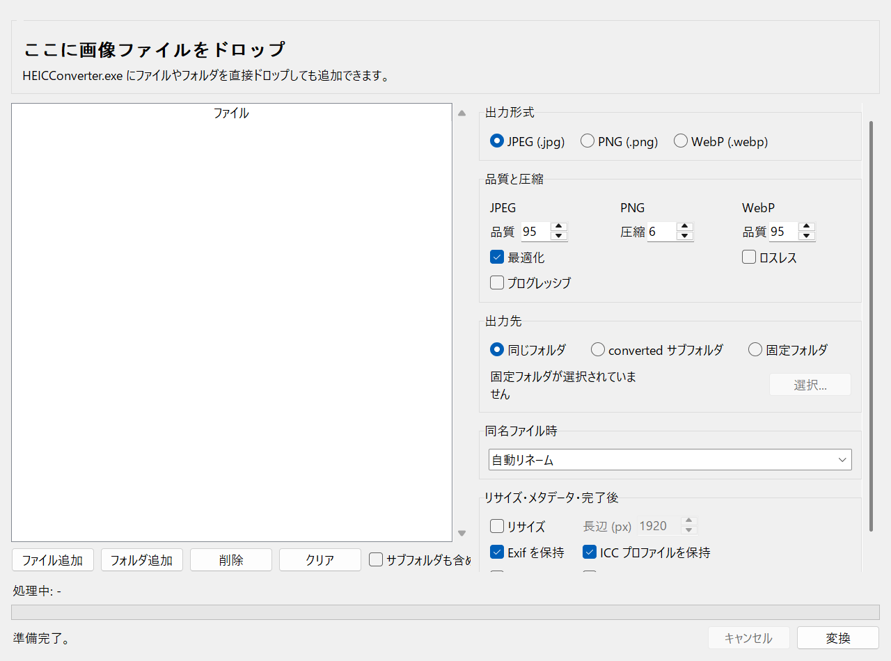
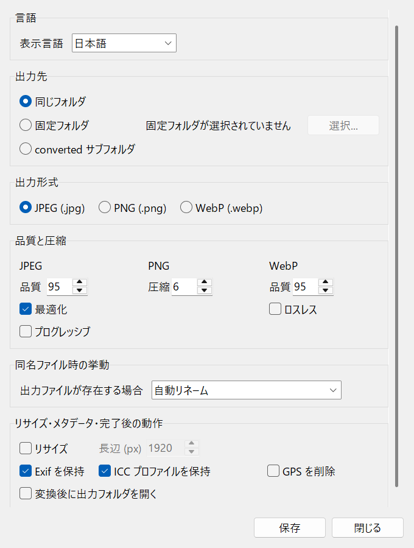

# HEIC写真をWindowsで手軽に変換

iPhoneなどから写真をWindows PCへ移したとき、ファイルの拡張子が `.heic` になっていて困ったことはないでしょうか。

HEICは写真をきれいなまま比較的コンパクトに保存できる形式ですが、使うアプリやWebサービスによっては、そのまま開けなかったり、アップロードできなかったりすることがあります。数枚なら個別に変換してもよいものの、旅行やイベントの写真が何十枚、何百枚とあると、それだけでひと仕事です。

そこで、HEICをJPEG・PNG・WebPへまとめて変換できるWindows向けツール「HEIC Converter」を公開しました。2026年7月15日に、リサイズ機能と連続変換の安定性を高めたv1.1.0をリリースしています。

変換はPCの中だけで完結します。配布ZIP版ならPythonやPowerShellの準備も不要です。

▶ [HEIC Converterをダウンロードする（無料）](https://github.com/AiWithYou/HEICtoJPG/releases/latest/download/HEICConverter.zip)

## 使い方は、ZIPを展開してドロップするだけ

1. `HEICConverter.zip` をダウンロードする
2. ZIPを展開する
3. 中にある `HEICConverter.exe` を起動する
4. 変換したい画像ファイル、またはフォルダを画面へドラッグ＆ドロップする
5. 出力形式を選んで「変換」を押す

初期設定ではJPEGに変換し、元の画像と同じフォルダへ保存します。まずは設定を変えず、そのまま試せます。

## HEIC以外の画像整理にも使えます

入力はHEIC／HEIFだけではありません。JPEG、PNG、WebP、BMP、GIF、TIFF、AVIFなど、一般的な画像形式にも対応しています。出力形式は次の3種類です。

- JPEG：写真を幅広いアプリやWebサービスで使いたいとき
- PNG：可逆形式で保存したいとき
- WebP：画質とファイルサイズのバランスを取りたいとき

アニメーション画像や複数ページ画像は、読み込んだ先頭のフレームを変換します。

複数のファイルやフォルダをまとめて追加でき、1枚の変換に失敗しても、残りの画像は処理を続けます。出力先は「元と同じフォルダ」「`converted` サブフォルダ」「指定したフォルダ」から選べます。

同名ファイルがすでにある場合も、自動リネーム、スキップ、上書き、エラー停止から動作を選択できます。初期設定は、元のファイルを誤って上書きしにくい自動リネームです。

## v1.1.0では、変換と同時にリサイズできるようになりました

今回の更新で、画像の「最大長辺」をピクセル数で指定できるようになりました。

たとえば長辺を1920pxに設定すると、縦横比を保ったまま、それより大きな画像だけを縮小します。小さな画像を無理に拡大することはありません。

写真をWebへ掲載したいとき、メールやチャットで送りたいとき、保存容量を少し軽くしたいときに、形式変換とリサイズを一度で済ませられます。

このほか、v1.1.0では次の点も改善しました。

- フォルダの連続変換中に1ファイルで問題が起きても、残りの処理を継続
- 再帰変換時に、出力済みの `converted` フォルダを再び変換しないよう改善
- 回転補正やリサイズ後の実際の大きさに合わせて、保持するExif寸法情報を更新
- 設定値や読み取れないフォルダに問題があるとき、対象が分かるエラーを表示
- 縦幅の小さい画面でも設定画面の保存・終了ボタンへ届くよう、スクロールに対応

## 写真のメタデータも選べます

Exif情報やICCカラープロファイルを保持するか、GPS情報を削除するかを設定できます。

撮影情報を残して整理したい場合にも、共有前に位置情報を外したい場合にも、用途に合わせて選択できます。JPEGの品質、PNGの圧縮レベル、WebPの品質やロスレス保存も調整できます。

## 必要なときだけ開く、軽量なWindowsツールです

HEIC Converterは、Windows 10／11向けの小さなデスクトップツールです。常駐監視や重いGUIフレームワークは使わず、必要なときに起動して変換する作りにしています。

こんな方に向いています。

- iPhoneなどから取り込んだHEIC写真をWindowsで扱いたい
- WebサービスへアップロードできるJPEGやPNGへ変換したい
- 大量の写真を1枚ずつ変換したくない
- 画像形式の変換とリサイズをまとめて済ませたい
- 写真を外部サービスへアップロードせず、PC内で処理したい

まず使う場合は、GitHub Releasesの配布ZIPをダウンロードしてください。ZIPには実行ファイルと必要なライセンス文書をまとめてあります。ほかの方へ共有するときも、実行ファイル単体ではなく配布ZIPのリンクをご案内ください。

▶ [最新版のHEICConverter.zipをダウンロード](https://github.com/AiWithYou/HEICtoJPG/releases/latest/download/HEICConverter.zip)

▶ [ソースコードと詳しい使い方を見る](https://github.com/AiWithYou/HEICtoJPG)

不具合や「こういう使い方もしたい」という要望があれば、[GitHub Issues](https://github.com/AiWithYou/HEICtoJPG/issues)からお知らせください。日々の写真整理で、HEICが少しでも扱いやすくなればうれしいです。

#HEIC #画像変換 #Windows #フリーソフト #オープンソース
